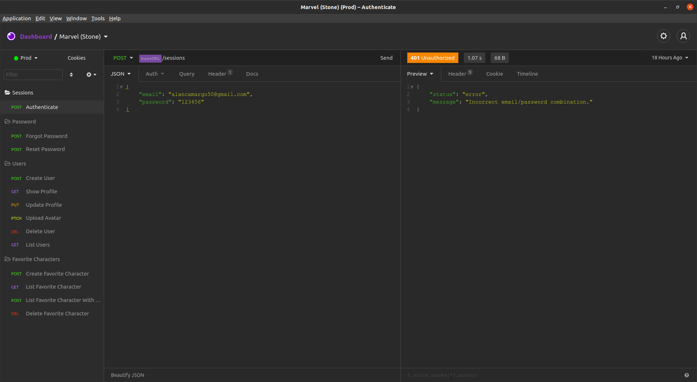

# Technologies Used

- Nodejs
- Typescript
- Jest / TDD
- MVC / DDD
- AWS S3 - SES
- CI / CD
- Postgres
- Eslint

<br />

Link para site [Marvel Desafio](https://marvel.devideias.com).

Link para repositorio [Repositorio Frontend](https://github.com/alanhrc/Marvel-Desafio-Stone).

<br />

```json
  Open the project and whrite

  yarn

  Clone file .env.example to .env and fill it
```
<br />


